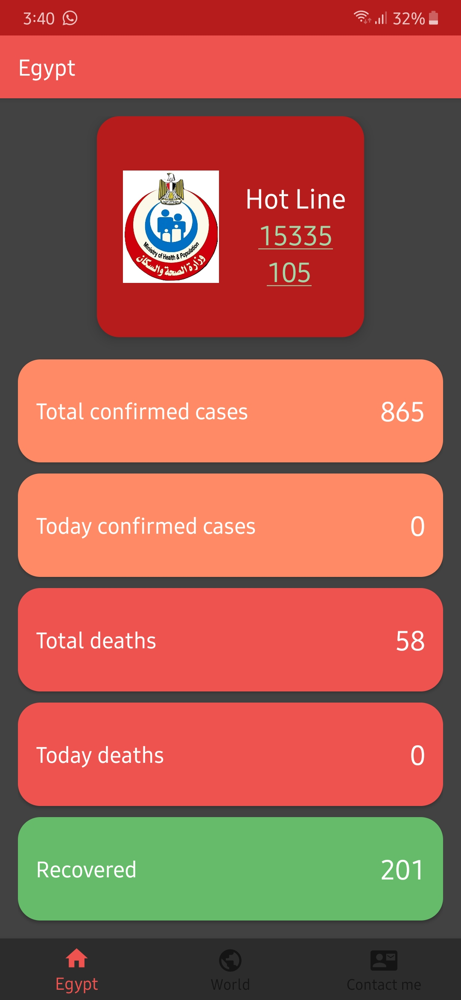
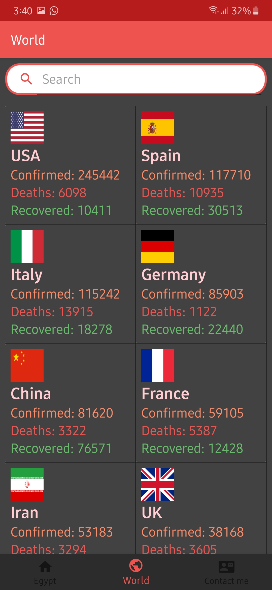
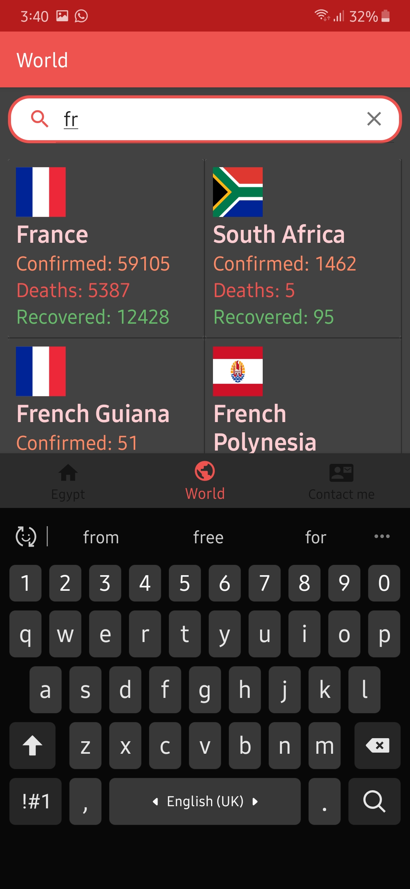
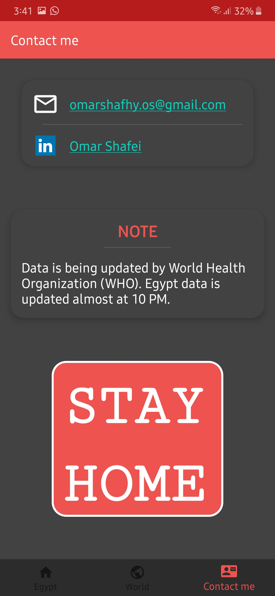

# Features
1- Responsive design.

2- Searching functionality.

3- Support two languages(English, Arabic):
    Depending on the mobile device language 

# Download link:
https://dl.orangedox.com/coronaTracker
    
# Dependencies:
    implementation 'com.google.android.material:material:1.1.0'
    implementation "androidx.cardview:cardview:1.0.0"
    implementation 'androidx.recyclerview:recyclerview:1.1.0'
    implementation 'com.squareup.okhttp3:okhttp:4.4.0'
    implementation 'com.squareup.picasso:picasso:2.71828'
    implementation 'androidx.navigation:navigation-fragment:2.2.1'
    implementation 'androidx.navigation:navigation-ui:2.2.1'
    implementation 'androidx.lifecycle:lifecycle-extensions:2.2.0'

   

   
